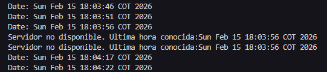

# DATAGRAMS-ARSW-LAB03

## Descripcion
Este proyecto implementa un servidor y un cliente UDP que intercambian la hora actual. El cliente solicita la hora cada 5 segundos y el servidor responde con la fecha y hora del sistema. La comunicacion es sin conexion y se basa en datagramas UDP.

## Objetivo
Ilustrar el uso de sockets UDP, el envio de datagramas, la recepcion de respuestas y el manejo de tiempos de espera en el cliente.

## Logica del servidor
- Abre un socket UDP en el puerto 4445.
- Espera paquetes entrantes de forma continua.
- Al recibir un paquete, obtiene la fecha y hora actual del sistema.
- Envia esa fecha al cliente que hizo la solicitud (misma IP y puerto de origen).

Flujo resumido:
1. Crear el socket en el puerto 4445.
2. Recibir un datagrama.
3. Construir la respuesta con la fecha actual.
4. Enviar la respuesta al emisor.

## Logica del cliente
- Crea un socket UDP y configura un tiempo de espera de 3 segundos.
- Cada 5 segundos envia un datagrama vacio al servidor.
- Si recibe respuesta, actualiza e imprime la ultima hora conocida.
- Si se agota el tiempo de espera, informa que el servidor no esta disponible y muestra la ultima hora conocida.

Flujo resumido:
1. Crear el socket y configurar el timeout.
2. Enviar un datagrama vacio al servidor.
3. Esperar la respuesta.
4. Actualizar la ultima hora o informar timeout.
5. Dormir 5 segundos y repetir.

## Configuracion
- IP del servidor: 127.0.0.1
- Puerto del servidor: 4445
- Intervalo de consulta: 5000 ms
- Tiempo de espera: 3000 ms

## Ejecucion
1. Ejecutar el servidor primero.
2. Ejecutar el cliente en otra consola.
3. El cliente imprimira la fecha recibida cada 5 segundos.

## Consideraciones UDP
- No hay garantia de entrega ni de orden en los datagramas.
- El cliente maneja la ausencia de respuesta con un timeout.

## Notas
- El servidor debe estar en ejecucion antes de iniciar el cliente.
- Si se cambia la IP o el puerto, debe actualizarse el cliente.

## Ejemplo de ejecucion:
- El servidor consulta hora cada 5 segundos, asi el servidor este prendido o no
